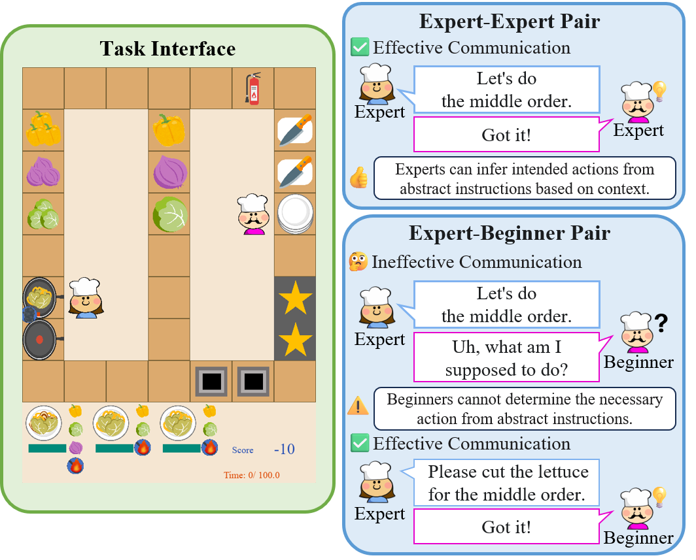
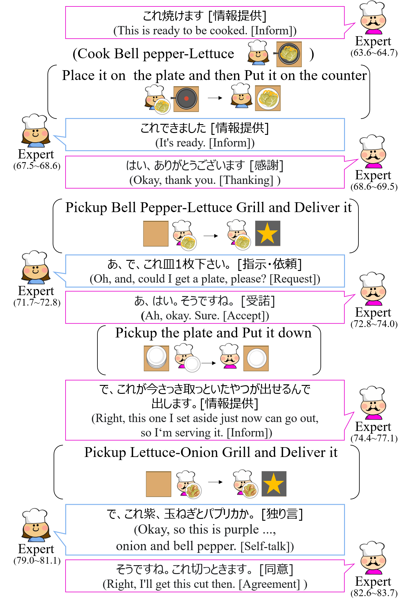
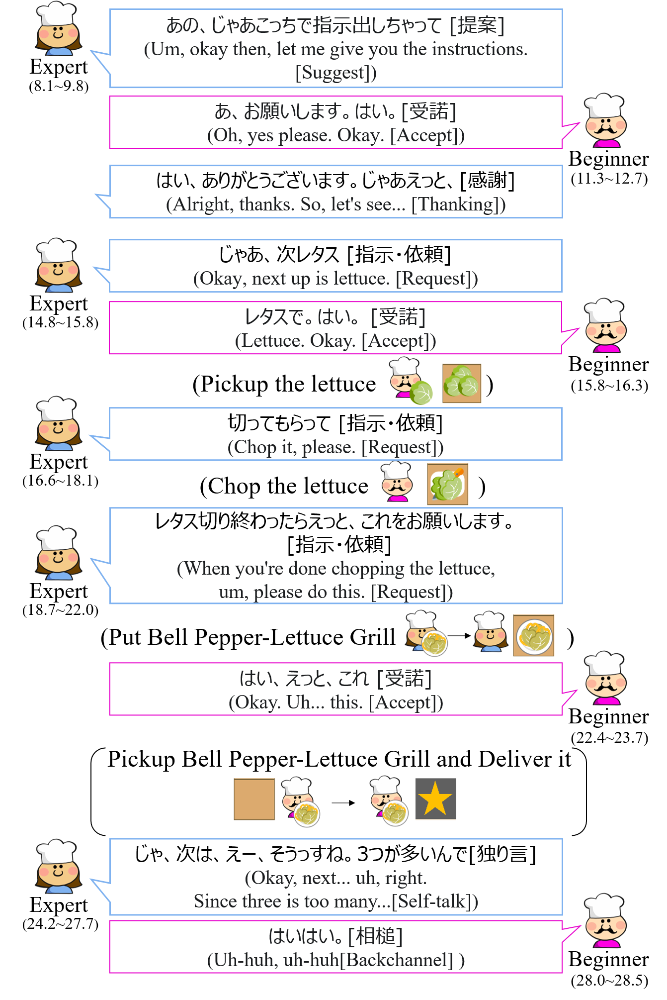

# OvercookedChat : A Japanese Human-Human Dialogue Dataset from a Real-Time Collaborative Cooking Game. 


[](https://creativecommons.org/licenses/by-nc/4.0/)




**OvercookedChat** is a human-collected Japanese dialogue dataset for real-time collaborative tasks. 
This dataset was collected through collaborative work between players with pre-assessed task proficiency in a real-time cooperative cooking game environment inspired by the popular game "Overcooked." 
This dataset was collected using an offline cooperative cooking game environment specifically designed to support controlled two-player experiments.  
➡️ The implementation of the data collection environment is available here:  
🔗 https://github.com/UEC-InabaLab/OvercookedChat-Env

This work has been **accepted to the main conference of SIGDAIL 2025**.

<div style="display: flex; gap: 20px;">
  
  
</div>

## 🌟 Key Features
- **111 Game Dialogues** : A collection of dialogues from 54 participants engaged in a real-time, high-pressure collaborative cooking game.

- **3,412 Annotated Utterances**: Captures spontaneous, spoken Japanese communication, with each utterance tagged with one of 16 dialogue acts (e.g., Inform, Request, Suggest).

- **Rich Multi-Modal Data**: Synchronizes dialogue with 48,781 in-game actions, game scores, and detailed post-session feedback for a holistic view of the collaboration.

- **Post-Session Subjective Feedback**: Gathers player perspectives on cooperation, communication, and adaptation through an 8-item, 5-point Likert-scale questionnaire after each game.

## 📊 Dataset Statistics

| Category | Total |
|------------------|-----------|
| # **Dialogues (Games)** | 111 |
| # **Speakers (Participants)** | 54 |
| # **Utterances** | 3,412 |
| # **Words** | 22,844 |
| **Avg. utterances/dialogue** | 30.74 |
| **Avg. words/utterance** | 6.69 |
| # **In-Game Actions** | 48,781 |


## 📄 Citation

If you use this dataset, please cite the following paper:

```bibtex
@inproceedings{overcookedchat,
  title     = {Task Proficiency-Aware Dialogue Analysis
 in a Real-Time Cooking Game Environment},
  author    = {Kaito Nakae and Michimasa Inaba},
  booktitle = {Proceedings of the 26th Annual Meeting of the Special Interest Group on Discourse and Dialogue},
  year      = {2025},
  url       = {https://github.com/UEC-InabaLab/OvercookedChat}
}
```

## 📁 Dataset Structure

Each game session is provided as a single JSON file, which contains four primary keys:

- log: A chronological array of timestamped game actions and dialogue utterances, including player IDs and dialogue act tags.

- score: The final game score, including successful/failed dishes and a normalized Z-score.

- survey: Post-session survey results with 8 Likert-scale questions on collaboration and free-form feedback.

- players: Static participant data, including pre-measured proficiency, gaming experience, and personality traits.

## ⚖️ License

Overcookedchat is released under the [**Creative Commons Attribution-NonCommercial 4.0 International (CC BY-NC 4.0)**](https://creativecommons.org/licenses/by-nc/4.0/) license.

[![CC BY-NC 4.0][cc-by-nc-image]][cc-by-nc]

[cc-by-nc]: https://creativecommons.org/licenses/by-nc/4.0/
[cc-by-nc-image]: https://licensebuttons.net/l/by-nc/4.0/88x31.png
[cc-by-nc-shield]: https://img.shields.io/badge/License-CC%20BY--NC%204.0-lightgrey.svg
